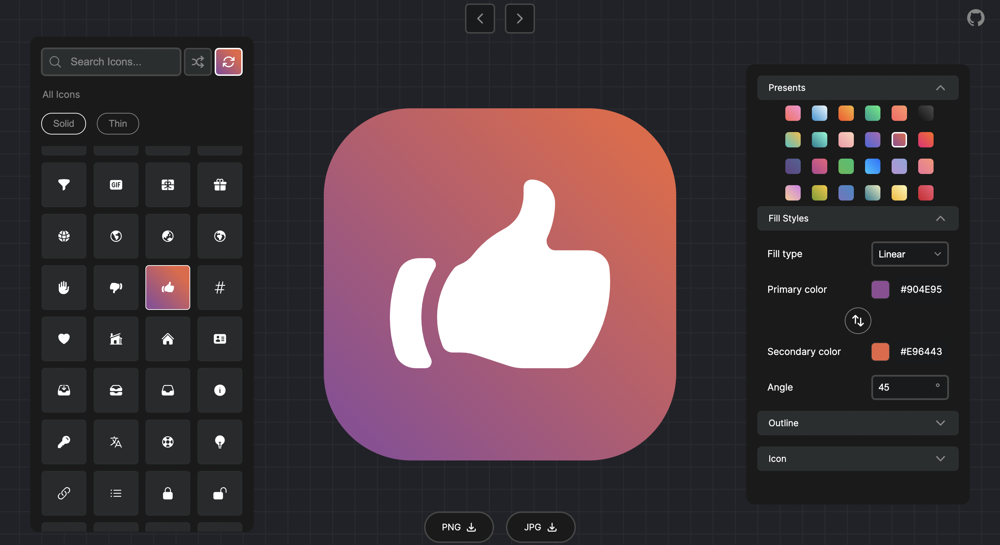
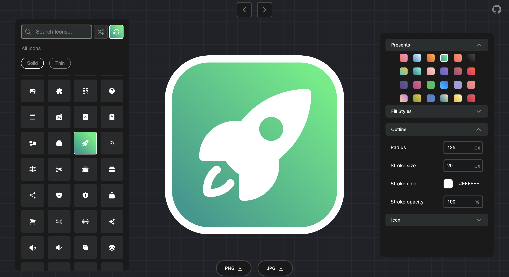
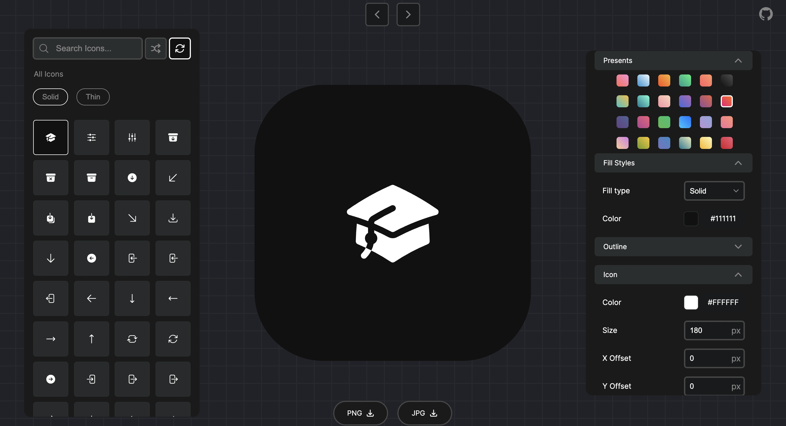
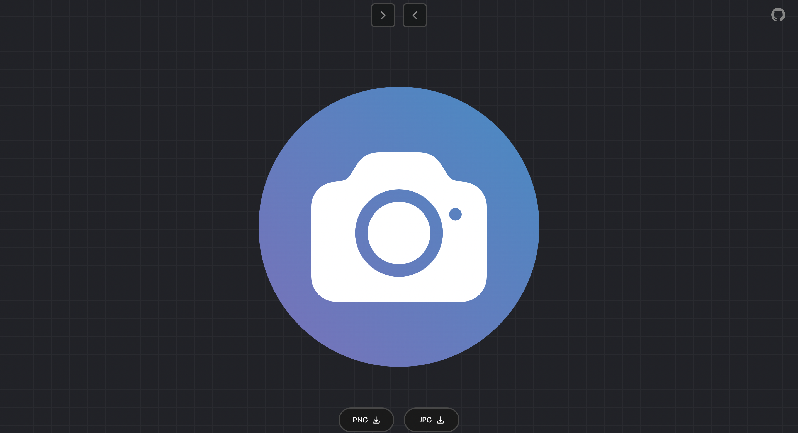

# PixelIcons

PixelIcons is my version of the Raycast icon maker. This project allows users to customize icons with options for background color, size, and other functionalities. With a focus on delivering a great UI, PixelIcons offers an intuitive and user-friendly experience for icon personalization. I've added a couple of features that are not part of the Raycast Icon Maker. You can refer to them in the features section.

- ReactJs, CSS, Vite (Frontend tooling), Figma (Design tool).

## Demo









## Features

1. PixelIcons web app contains three sections:

   - Icon Panel: For icons, random preset color generation, and random icon selection.

   - Icon preview.
   - Icon customizer.

2. Customize icon color/size, icon background color, and border color/size.

3. Download icons in PNG or JPG format.

#### Extra features:

- Separate sections for solid and thin icons.
- Option for random preset color generation.
- Toggle options for the Icon Panel and Icon Customizer.
- Real-time color swap between primary and secondary colors in the Fill Styles section of the Icon Customizer.

##### More features will be added...

## Installation

Follow these steps to set up Pixel Icon on your local machine:

1. Fork the repository on GitHub.

2. Clone the repository:

   ```bash
   git clone https://github.com/your-username/PixelIcons.git
   cd GeminiMemo
   ```

3. Install dependencies:

   ```bash
   npm install
   ```

4. Start the development server:

   ```bash
   npm run dev
   ```

   The app will now be running on `http://localhost:5173/` or another port.

## Usage

- You can interact with the tool, no detailed explanation is necessary 😊

## Credits

Thanks to -

- Heroicons - Beautiful hand-crafted SVG icons, by the makers of Tailwind CSS.
- Icon Maker by Raycast.

## Contact

If you have any questions or suggestions, feel free to open an issue or reach out to me!

<a href="https://github.com/Vasudevatirupathinaidu" target="_blank"></a> <a href="https://medium.com/@tirupathinaidu" target="_blank"></a> <a href="https://dev.to/deva" target="_blank"></a> <a href="https://twitter.com/vasudev617" target="_blank"></a> <a href="https://www.youtube.com/@vasudev16180" target="_blank"></a>
